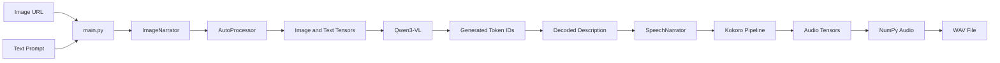

multimodal-image-narrator/
├── main.py
├── multimodal_image_narrator/
│   ├── __init__.py
│   ├── vision.py
│   └── speech.py
├── outputs/
├── requirements.txt
├── README.md
└── .gitignore

Component Responsibilities
main.py
The application entry point and orchestration layer.
- Defines the model, image, prompt, and output path.
- Creates ImageNarrator and SpeechNarrator objects.
- Passes the image description from the vision stage to the speech stage.
- Prints the description and output location.
vision.py
Owns all vision-language model behavior.
- make_messages() creates Qwen’s multimodal chat structure.
- ImageNarrator.__init__() loads the processor and Qwen model.
- describe() preprocesses the image and text.
- Calls model.generate() to perform inference.
- Removes the original input tokens.
- Decodes generated token IDs into readable text.
speech.py
Owns all text-to-speech behavior.
- Loads Kokoro through KPipeline.
- Converts text into one or more audio tensors.
- Moves tensors to the CPU and converts them to NumPy arrays.
- Combines multiple audio chunks.
- Saves the result as a 24 kHz WAV file.
__init__.py
Marks multimodal_image_narrator as a Python package. It is currently empty but can later expose public classes through shorter imports.
External Dependencies
- PyTorch: tensor operations and model execution
- Transformers: Qwen model and processor APIs
- Accelerate: automatic device placement
- Kokoro: text-to-speech inference
- eSpeak NG: pronunciation fallback
- NumPy: combines audio chunks
- SoundFile: writes WAV files
- Hugging Face Hub: downloads and caches model weights
Architectural Principles Learned
- Separation of concerns between vision, speech, and orchestration
- Encapsulation of model state inside classes
- Passing one component’s output into another component
- Keeping configuration separate from reusable model logic
- Managing dependencies through a virtual environment
- Converting between tokens, tensors, NumPy arrays, text, and audio
- Handling external model downloads and local caching
Current Limitations
- Image, prompt, voice, and output path are hardcoded.
- Both models load again whenever the program starts.
- There is no CLI, API, graphical interface, or test suite yet.
- Remote image failures are not handled gracefully.
- Performance depends on image size and hardware acceleration.
This describes the project as a modular multimodal inference pipeline. That phrase is both accurate and useful when explaining it during an interview.